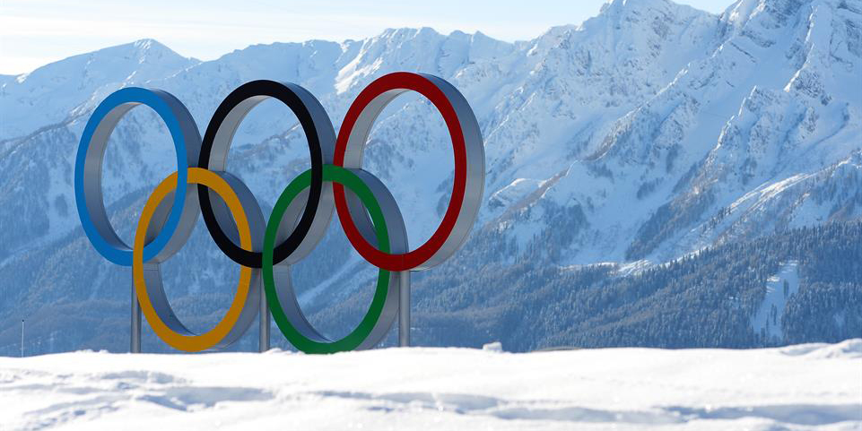

# Canada Is one of the best: Winter Olympics

## Thesis

Canada is one of the best Olympic teams. I will showcase this through, medals won overall based on a beginning to current time frame, through number of gold, silver, bronze overall in comparison to the other top ten medal counts and through specific sports such as Hockey and Ice skating. 

## Requirments

Use a modern Browser such as [Firefox](https://www.mozilla.org/en-CA/firefox/new/) or [Chrome](https://www.google.ca/chrome/?brand=CHBD&gclsrc=aw.ds&&gclid=CjwKCAjw29vsBRAuEiwA9s-0B6zIdw5_qV4ETvbcN4042nlkfk9YggWT_DI1vM4UH4vWB2I0pdWUdhoCBWoQAvD_BwE). Avoid internet exploror. You will need git installed locally as well as a good code editor such as [Sublime](https://www.sublimetext.com).This site is built with HTML and CSS as well as python generated graphs. Javascript subfolder is added for the habit of future work flow. 

### Built With

<ul>
	<li>Html</li>
	<li>CSS</li>
	<li>JS</li>
</ul>

## Licence

MIT

## Data

Data was provided by the IOC Research and Reference Service and published by The Guardian's Datablog.

## Author

Thanks for checking out my beginner workflow with Github, Terminal and Sublime Text.
by Natasha Adler

